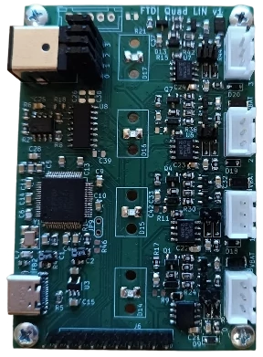

# FTDI Quad LIN

FTDI Quad-LIN is an FTDI-based board that enables communication with up to 4 LIN channels.

- 4x LIN master channels
- USB-C connector
- channel LED indication of power presence and communication activity
- power jack to power selected transceiver and its network



## Getting started
Install dkms driver for sllin module:
```
$ ./install_driver.sh
```

Then run following commands to:
- write given serial number into the device
- install a udev rule to start `ldattach@.service` on USB plug-in
- copy `sllin.network` file to automatically bringup `slcan` interface up

```
$ sudo apt install ftdi-eeprom
$ ./setup.sh some_serial_number
```
