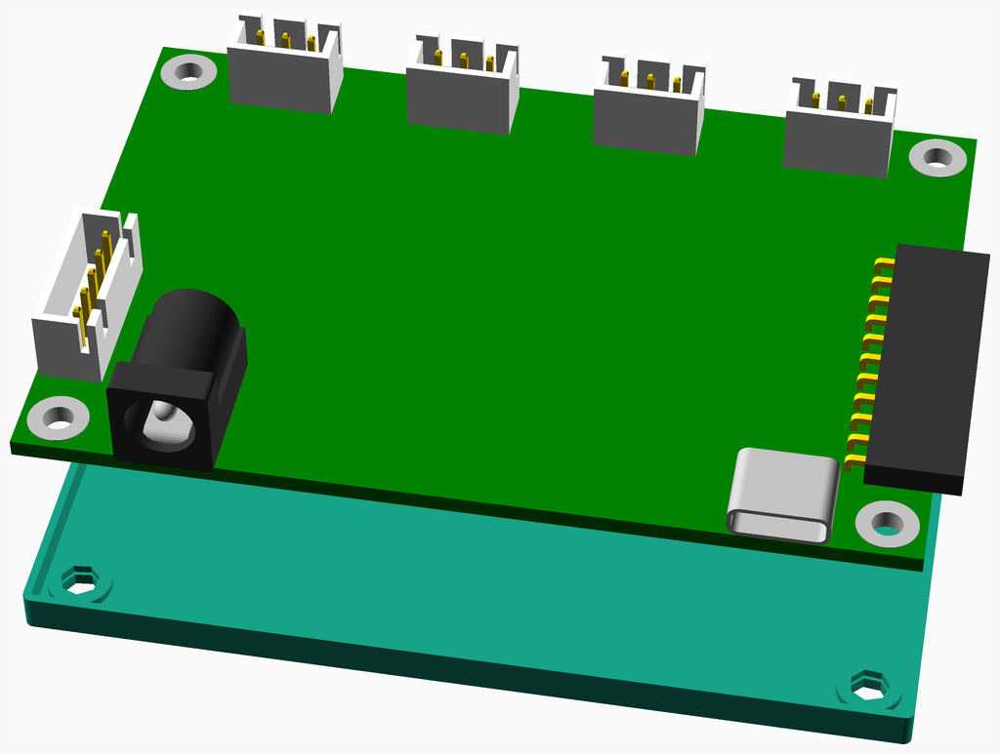
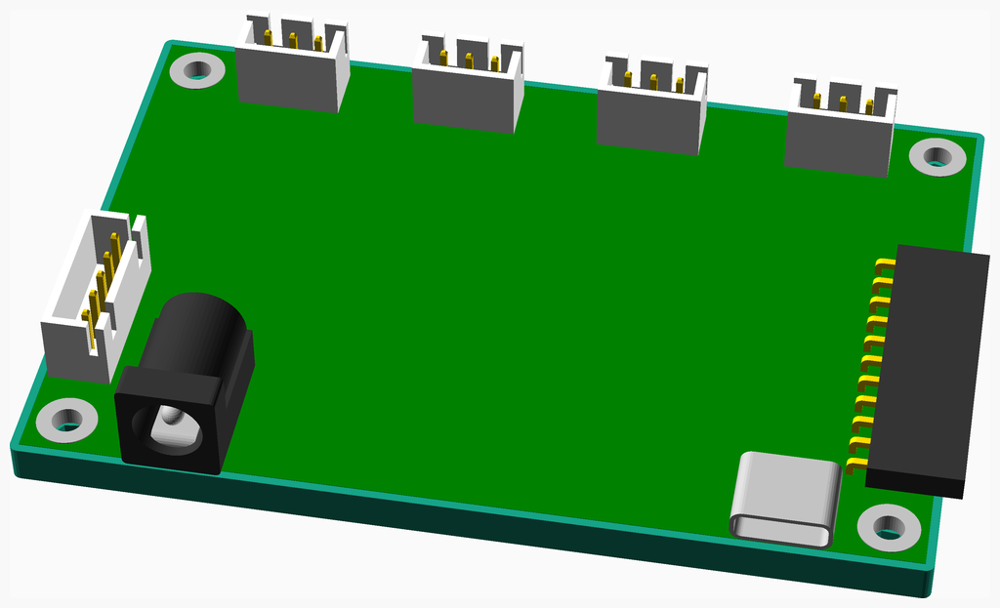
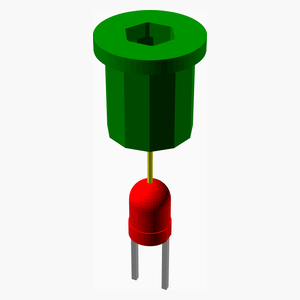
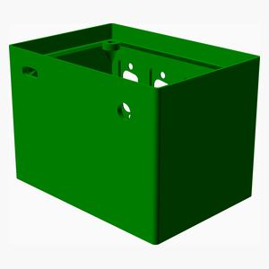
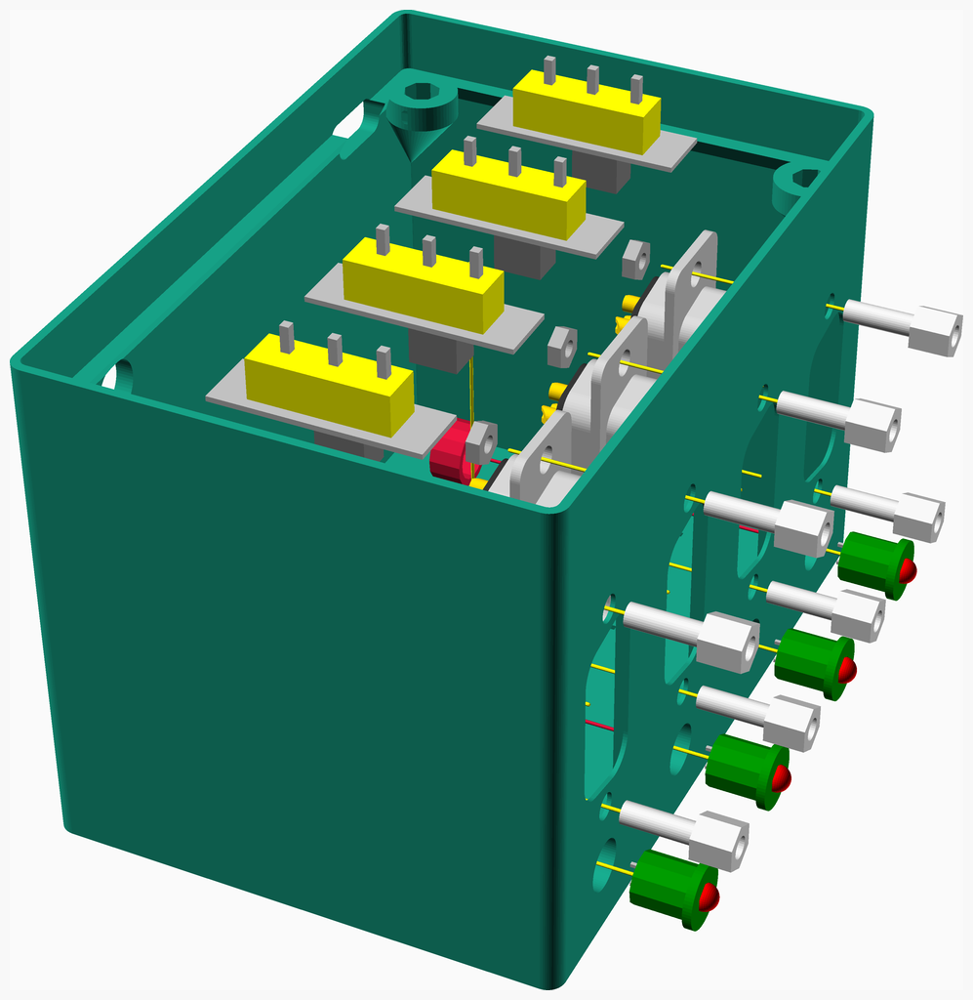
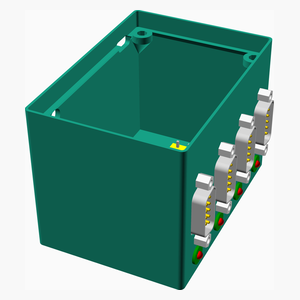
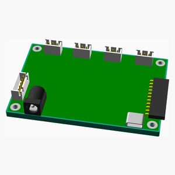
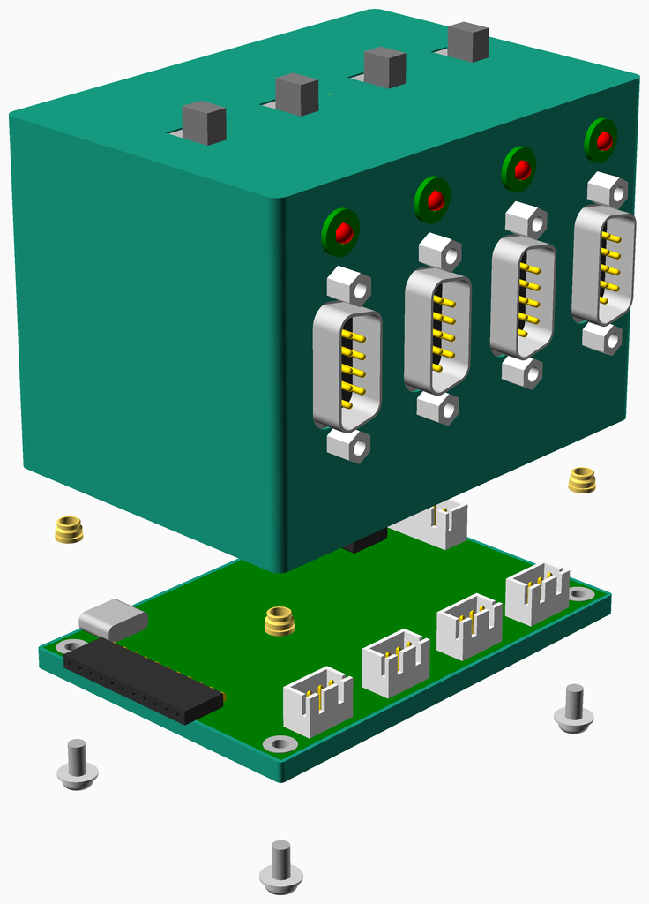

# Case

---
## Table of Contents
1. [Parts list](#Parts_list)
1. [Ftdi Quad Lin Box Base Assembly](#ftdi_quad_lin_box_base_assembly)
1. [Led Activity Assembly](#led_activity_assembly)
1. [Ftdi Quad Lin Box Assembly](#ftdi_quad_lin_box_assembly)
1. [Main Assembly](#main_assembly)

[Top](#TOP)

---

## Parts list
| Ftdi&nbsp;Quad&nbsp;Lin&nbsp;Box&nbsp;Base | 4 x Led&nbsp;Activity | Ftdi&nbsp;Quad&nbsp;Lin&nbsp;Box | Main | TOTALS |  |
|---:|---:|---:|---:|---:|:---|
|  |  |  |  | | **Vitamins** |
| &nbsp;&nbsp;.&nbsp; | &nbsp;&nbsp;.&nbsp; | &nbsp;&nbsp;4&nbsp; | &nbsp;&nbsp;.&nbsp; |  &nbsp;&nbsp;4&nbsp; | &nbsp;&nbsp; D-type 9 way  plug |
| &nbsp;&nbsp;.&nbsp; | &nbsp;&nbsp;.&nbsp; | &nbsp;&nbsp;8&nbsp; | &nbsp;&nbsp;.&nbsp; |  &nbsp;&nbsp;8&nbsp; | &nbsp;&nbsp; D-type connector pillar |
| &nbsp;&nbsp;4&nbsp; | &nbsp;&nbsp;.&nbsp; | &nbsp;&nbsp;.&nbsp; | &nbsp;&nbsp;.&nbsp; |  &nbsp;&nbsp;4&nbsp; | &nbsp;&nbsp; JST XH connector 3 way |
| &nbsp;&nbsp;1&nbsp; | &nbsp;&nbsp;.&nbsp; | &nbsp;&nbsp;.&nbsp; | &nbsp;&nbsp;.&nbsp; |  &nbsp;&nbsp;1&nbsp; | &nbsp;&nbsp; JST XH connector 5 way |
| &nbsp;&nbsp;.&nbsp; | &nbsp;&nbsp;4&nbsp; | &nbsp;&nbsp;.&nbsp; | &nbsp;&nbsp;.&nbsp; |  &nbsp;&nbsp;4&nbsp; | &nbsp;&nbsp; LED 3 mm red |
| &nbsp;&nbsp;.&nbsp; | &nbsp;&nbsp;.&nbsp; | &nbsp;&nbsp;8&nbsp; | &nbsp;&nbsp;.&nbsp; |  &nbsp;&nbsp;8&nbsp; | &nbsp;&nbsp; Nut M2 x 1.6mm  |
| &nbsp;&nbsp;1&nbsp; | &nbsp;&nbsp;.&nbsp; | &nbsp;&nbsp;.&nbsp; | &nbsp;&nbsp;.&nbsp; |  &nbsp;&nbsp;1&nbsp; | &nbsp;&nbsp; Pin socket 11 x 1 right_angle |
| &nbsp;&nbsp;.&nbsp; | &nbsp;&nbsp;.&nbsp; | &nbsp;&nbsp;4&nbsp; | &nbsp;&nbsp;.&nbsp; |  &nbsp;&nbsp;4&nbsp; | &nbsp;&nbsp; SlideSwitch |
| &nbsp;&nbsp;1&nbsp; | &nbsp;&nbsp;.&nbsp; | &nbsp;&nbsp;.&nbsp; | &nbsp;&nbsp;.&nbsp; |  &nbsp;&nbsp;1&nbsp; | &nbsp;&nbsp; ftdi quad lin |
| &nbsp;&nbsp;7&nbsp; | &nbsp;&nbsp;4&nbsp; | &nbsp;&nbsp;24&nbsp; | &nbsp;&nbsp;.&nbsp; | &nbsp;&nbsp;35&nbsp; | &nbsp;&nbsp;Total vitamins count |
|  |  |  |  | | **3D printed parts** |
| &nbsp;&nbsp;.&nbsp; | &nbsp;&nbsp;4&nbsp; | &nbsp;&nbsp;.&nbsp; | &nbsp;&nbsp;.&nbsp; |  &nbsp;&nbsp;4&nbsp; | &nbsp;&nbsp;LED3mm_bezel.stl |
| &nbsp;&nbsp;.&nbsp; | &nbsp;&nbsp;.&nbsp; | &nbsp;&nbsp;4&nbsp; | &nbsp;&nbsp;.&nbsp; |  &nbsp;&nbsp;4&nbsp; | &nbsp;&nbsp;LED3mm_bezel_retainer.stl |
| &nbsp;&nbsp;.&nbsp; | &nbsp;&nbsp;.&nbsp; | &nbsp;&nbsp;1&nbsp; | &nbsp;&nbsp;.&nbsp; |  &nbsp;&nbsp;1&nbsp; | &nbsp;&nbsp;ftdi_quad_lin_box.stl |
| &nbsp;&nbsp;1&nbsp; | &nbsp;&nbsp;.&nbsp; | &nbsp;&nbsp;.&nbsp; | &nbsp;&nbsp;.&nbsp; |  &nbsp;&nbsp;1&nbsp; | &nbsp;&nbsp;ftdi_quad_lin_box_base.stl |
| &nbsp;&nbsp;1&nbsp; | &nbsp;&nbsp;4&nbsp; | &nbsp;&nbsp;5&nbsp; | &nbsp;&nbsp;.&nbsp; | &nbsp;&nbsp;10&nbsp; | &nbsp;&nbsp;Total 3D printed parts count |

[Top](#TOP)

---

## Ftdi Quad Lin Box Base Assembly
### Vitamins
|Qty|Description|
|---:|:----------|
|4| JST XH connector 3 way|
|1| JST XH connector 5 way|
|1| Pin socket 11 x 1 right_angle|
|1| ftdi quad lin|

### 3D Printed parts

| 1 x ftdi_quad_lin_box_base.stl |
|---|
|  

### Assembly instructions

Place FTDI Quad LIN PCB into base part.

[Top](#TOP)

---

## 4 x Led Activity Assembly
### Vitamins
|Qty|Description|
|---:|:----------|
|4| LED 3 mm red|

### 3D Printed parts

| 4 x LED3mm_bezel.stl |
|---|
|  

### Assembly instructions

1. Solder wire from J7 pin 5 to 3th LED anode (+)
1. Chain and solder wire to all other anodes (+)
1. solder 3th LED cathode (-) to J7 pin 4
1. solder 2th LED cathode (-) to J7 pin 3
1. solder 1th LED cathode (-) to J7 pin 2
1. solder 0th LED cathode (-) to J7 pin 1
1. Insert LEDs into the bezels

[Top](#TOP)

---

## Ftdi Quad Lin Box Assembly
### Vitamins
|Qty|Description|
|---:|:----------|
|4| D-type 9 way  plug|
|8| D-type connector pillar|
|8| Nut M2 x 1.6mm |
|4| SlideSwitch|

### 3D Printed parts

| 4 x LED3mm_bezel_retainer.stl | 1 x ftdi_quad_lin_box.stl |
|---|---|
|  |  

### Sub-assemblies

| 4 x led_activity_assembly |
|---|
|  

### Assembly instructions

1. Insert 4x LED with bezel into hole and screw with retainer
2. Insert 4x slide switches and glue them inside
3. insert 4x DCONN9 connectors and glue them inside

[Top](#TOP)

---

## Main Assembly
### Sub-assemblies

| 1 x ftdi_quad_lin_box_assembly | 1 x ftdi_quad_lin_box_base_assembly |
|---|---|
|  |  

### Assembly instructions

1. Connect LEDs wire into J7
1. Connect LIN 0 power switch to JP5
1. Connect LIN 1 power switch to JP6 
1. Connect LIN 2 power switch to JP7 
1. Connect LIN 3 power switch to JP8 
1. Connect LIN 1 CONN9 to J2
1. Connect LIN 2 CONN9 to J3
1. Connect LIN 3 CONN9 to J4
1. Connect LIN 4 CONN9 to J5
1. Screw base into the box with 4x M3 screws

[Top](#TOP)
